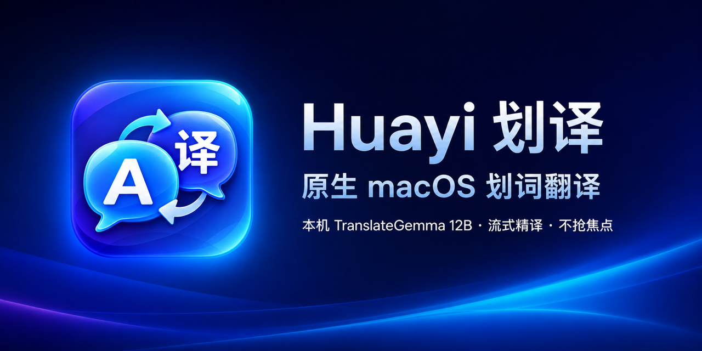

  
    
  

    
    
    
    
    
  

  

    <a href="#快速安装">快速安装</a> ·
    <a href="#翻译模式">翻译模式</a> ·
    <a href="#启用本地-translategemma-12b">本地 AI</a> ·
    <a href="#隐私">隐私</a> ·
    <a href="docs/PROMOTION.md">宣传素材</a>
  

**Huayi** 是一个 Swift + AppKit 菜单栏应用。划选文字后，鼠标附近只出现一个 18×18 的小触点；需要译文时悬停展开，不需要时尽量少挡正文。短句可以快速翻译，长文和技术术语可以交给本机 TranslateGemma 12B 流式处理。

> 当前是 source-first 预览版：请从源码在本机构建。仓库暂不分发未公证的通用安装包。

## 为什么是 Huayi

| 少打断 | 本机 12B 精译 | 原生体验 |
| --- | --- | --- |
| 划选后先显示 18×18 触点，悬停才展开译文，减少对正文的遮挡。 | TranslateGemma 12B 通过 Ollama 流式输出，长文、驼峰词和技术语境优先处理。 | Swift + AppKit 编写，无 Electron；译文面板不主动抢占键盘焦点。 |

### 细节也不含糊

- **自动**、**极速**、**AI 精译**三种模式。
- 明确选择 **AI 精译** 时，正文只发给本机 Ollama，不静默回退到在线服务。
- 长文面板支持滚动；用户回看前文时，流式结果不会强行把视图拉回底部。
- 系统 Siri Natural 语音本机朗读；可选 Microsoft Neural 在线语音。
- Option+Q 快捷模式，适合代码编辑器等容易误触的界面。
- 临时读取剪贴板后安全恢复；不会覆盖其间由用户或其他应用写入的新内容。
- 发布构建无分析遥测，也不会记录选中文本。

## 系统要求

- macOS 13 Ventura 或更高版本。
- Swift 5.9+ 与 Xcode Command Line Tools。
- 基础在线翻译不需要额外运行时。
- 本地 AI 推荐 Apple Silicon；TranslateGemma 12B 约占 8 GB 磁盘，并需要数 GB 统一内存。

本项目主要在 Apple Silicon 上测试。Intel Mac 可以从源码尝试构建，但本地 12B 模型的速度和内存占用未作为支持目标验证。

## 快速安装

~~~bash
git clone https://github.com/Rhiks/huayi-macos.git
cd huayi-macos
chmod +x install.sh uninstall.sh script/build_and_run.sh
./install.sh
~~~

首次运行时，在：

~~~text
系统设置 → 隐私与安全性 → 辅助功能
~~~

允许 **Huayi**。这是读取其他应用当前选区和发送临时复制快捷键所必需的权限。

如果刚授权后仍无法触发，请从菜单栏退出 Huayi，再运行一次 ./install.sh。

## 翻译模式

| 模式 | 默认数据路径 | 适合场景 |
| --- | --- | --- |
| 自动 | 短文本走 Google；长文和部分技术专名走本机 Ollama；本地 AI 不可用时可在线回退 | 日常使用 |
| 极速 | 文本通过 HTTPS POST 发往 Google 的非公开翻译端点 | 单词、短句、低延迟 |
| AI 精译 | 只访问 127.0.0.1:11434，不在线回退 | 敏感文本、长文、技术语境 |

自动模式的 AI 阈值目前为 320 个字符；OpenTelemetry 一类驼峰技术专名也会优先路由到本机 AI。

Google 路径使用的是未文档化端点，可能随时变化，也不应被理解为 Google 官方 SDK 或可用性承诺。

## 启用本地 TranslateGemma 12B

~~~bash
brew install ollama
brew services start ollama
ollama pull translategemma:12b
~~~

Huayi 会在菜单栏显示模型状态，并在 **自动** 或 **AI 精译** 模式下预热模型。模型权重不包含在本仓库中，使用时需遵守 [Gemma Terms](https://ai.google.dev/gemma/terms)。

## 语音

默认美音路径调用 macOS 已配置的系统 Siri Natural 语音，不固定强制某个声音。若希望使用 Quinn，可在 macOS 的“朗读内容/系统声音”设置中把美式英语声音改为 Quinn。

菜单中也可以启用 Microsoft Neural 在线语音；此模式需要安装 edge-tts：

~~~bash
uv tool install edge-tts
~~~

在线 Neural 会把待朗读文本发送给 Microsoft。网络失败时 Huayi 回退到系统语音。

## 隐私

Huayi 不包含分析 SDK。发布构建默认不写行为日志，选中文本不会写入磁盘缓存或 Unified Log。在线功能仍会把正文发送给相应服务：

- **极速**以及**自动**模式的部分请求：Google。
- **AI 精译**：本机 Ollama。
- 可选 Neural 语音：Microsoft。
- 系统语音：英语使用本机 /usr/bin/say，其他语言使用 AVSpeechSynthesizer。

完整的数据流、剪贴板行为和临时文件说明见 [PRIVACY.md](PRIVACY.md)。

## 本地开发

构建并启动：

~~~bash
./script/build_and_run.sh
~~~

构建并做启动验证：

~~~bash
./script/build_and_run.sh --verify
~~~

运行无需网络的回归测试：

~~~bash
swift build -c release
BIN="$(swift build -c release --show-bin-path)/Huayi"
"$BIN" --filter-self-test
"$BIN" --routing-self-test
"$BIN" --clipboard-self-test
~~~

本机已安装 Ollama 和模型时，可运行真实流式集成测试：

~~~bash
"$BIN" --ai-self-test
~~~

## 卸载

~~~bash
./uninstall.sh
~~~

卸载脚本会把应用移动到废纸篓，不会删除 Ollama 模型或 macOS 权限记录。

## 参与贡献

提交改动前请阅读 [CONTRIBUTING.md](CONTRIBUTING.md)。安全问题请按 [SECURITY.md](SECURITY.md) 私下报告。

需要介绍或分享 Huayi 时，可直接使用仓库中的 [宣传素材包](docs/PROMOTION.md)，其中包含社交预览图、短帖、长帖和平台化文案。

## 第三方与许可证

Huayi 源码以 [MIT License](LICENSE) 开源。Ollama、TranslateGemma、Gemma 权重和 edge-tts 是未捆绑的第三方组件，各自适用独立条款；详见 [THIRD_PARTY_NOTICES.md](THIRD_PARTY_NOTICES.md)。

本项目与 Apple、Google、Microsoft、Ollama 均无隶属、赞助或背书关系。
